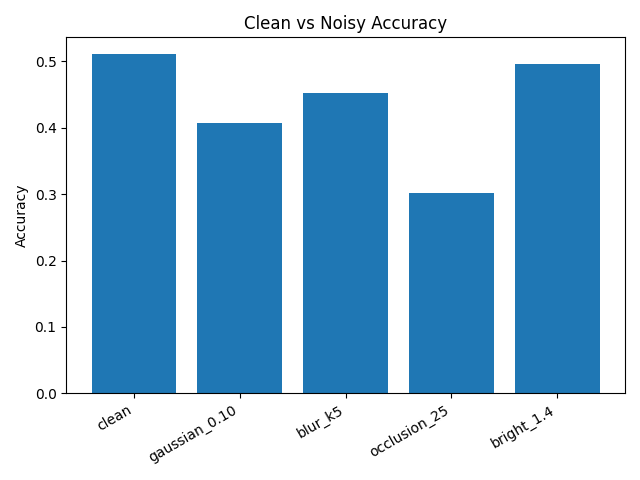
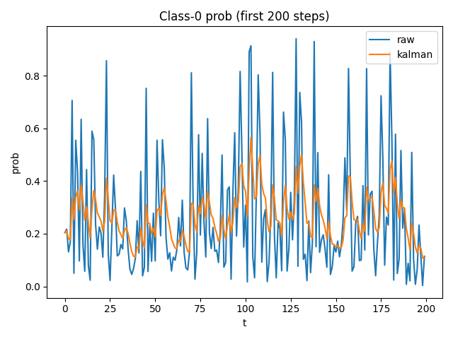

## Robustness Evaluation

We tested the baseline CNN model under several perturbations.
Dataset: FER2013 (or FakeData for pipeline validation).

| Scenario      | Accuracy |
|---------------|----------|
| clean         | 0.51     |
| gaussian_0.10 | 0.40     |
| blur_k5       | 0.45     |
| occlusion_25  | 0.30     |
| bright_1.4    | 0.49     |

## Kalman Smoothing

Applied a simple 1D Kalman filter on the class probability sequence.
- Raw accuracy: 0.51
- Smoothed accuracy: 0.74

## ONNX Export

Exported PyTorch model to ONNX:
- File: `models/fer2013_cnn.onnx`
- Verified with onnxruntime (max error < 1e-5)

Test inference results saved in:
- `results/infer_onnx.csv`

